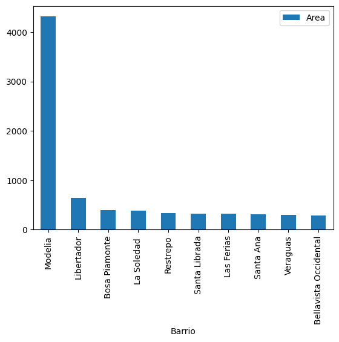

# Resolución de Desafíos del primer Curso de Inmersión de Datos de Alura Latam

En el primer curso de los 4 de la serie Inmersión de Datos de Alura Latam a la cual me inscribí la semana pasada, los instructores dejan 2 desafíos los cuales son los siguientes:

**1. Promedio de área de todos los inmuebles en los barrios en el dataset. El top 10.**

**2. Consultar otros datos estadísticos, conteo, mediana, valores mínimo y máximo.**

El primer desafío lo he realizado utilizando el siguiente código:

`inmuebles[['Barrio','Area']].groupby(['Barrio']).mean().sort_values(by=['Area'], ascending=False)`

Este código lo que hace es seleccionarme las columnas Barrio y Area para luego crear un tipo de "tabla dinámica" agrupando por valores no repetidos de la columna Barrio y a cada elemento que se agrupa le calculo el promedio tomando el Area. Sin embargo, solo necesito los 10 primeros y para eso escribo el siguiente código:

`inmuebles[['Barrio','Area']].groupby(['Barrio']).mean().sort_values(by=['Area'], ascending=False).head(10)`

Además, en el video el instructor Cristian deja el desafío de graficar lo anterior y para ello escribo el siguiente código:

`inmuebles[['Barrio','Area']].groupby(['Barrio']).mean().sort_values(by=['Area'], ascending=False).head(10).plot(kind='bar')`

Dicho código me genera el siguiente gráfico:

Realizado el primer desafío, ahora me propongo realizar el segundo desafío. En el video de la inmersión de datos, el instructor Cristian menciona los siguientes desafíos:

<ul>
<li>1-Encontrar la casa más barata</li>
<li>2-Encontrar el apartamento más barato</li>
<li>3-Encontrar la casa con el mayor número de baños</li>
<li>4-Encontrar la casa con el mayor número de habitaciones</li>
<li>5-Mostrar un resumen estadístico</li>
</ul>

Para realizar estos desafíos, necesito hacer una manipulación de la columna Valor ya que presenta tipo de data Object en formato de $ xxx.xxx.xxx donde los x son digitos por lo cual requiero obtener de dicha columna solo los números xxxxxxxxx y para ello escribo el siguiente código:

`import numpy as np`

`inmuebles['ValorNumero'] = inmuebles['Valor'].str.replace('[^\d]', '', regex=True).astype(np.int64)`

En el código anterior, primero importo la librería numpy la cual presenta el tipo de dato int64, el mismo tipo de dato del resto de columnas númericas del dataframe y luego reemplazo todo lo que no es digito con un string vacio para luego transformar aquello a tipo de dato int64. Luego creo la columna ValorNumero con esos datos en formato int64. Tomando las primeras 5 filas del dataframe tengo que:

El tipo de datos de esta nueva columna se puede visualizar acá:

Se observa que la columna ValorNumero posee tipo de dato **int64** que era lo deseado.
Por tanto, con los cambios hechos al dataframe ahora puedo realizar calculos con la columna ValorNumerico.

### 1-Encontrar la casa más barata

Para encontrar la casa más barata primero debo verificar qué tipos de casas existen lo cual lo realizo con el siguiente código:

`inmuebles['Tipo'].value_counts()`

Se muestra lo siguiente:

Acá observo que existe solo un tipo de casa que se denomina como **Casa**. Por tanto con esa comprobación lista ahora puedo calcular la casa que posee el valor más bajo y para ello escribo el siguiente código:

`inmuebles[inmuebles['Tipo']=='Casa']['ValorNumero'].min()`

Dicho código me muestra el valor 85000000. Por tanto, la casa más barata vale: **$ 85.000.000**

Ahora necesito encontrar la o las casas con ese valor y para ello escribo el siguiente código:

`inmuebles[inmuebles['Tipo']=='Casa'][inmuebles[inmuebles['Tipo']=='Casa']['ValorNumero']==inmuebles[inmuebles['Tipo']=='Casa']['ValorNumero'].min()]`

Dicho código me muestra lo siguiente:

Por tanto, la casa que se muestra en la imagen es la más barata.

### 2-Encontrar el apartamento más barato

Para encontrar el apartamento más barato primero necesito saber qué tipos de apartamentos existen y para ello utilizo la imagen que utilice para averiguar cuantos tipos de casas existen:

Observo que solo existe un tipo de apartamento el cual es **Apartamento**. Por tanto, ahora puedo encontrar el apartamento cuyo valor es más barato y para ello escribo el siguiente código:

`inmuebles[inmuebles['Tipo']=='Apartamento']['ValorNumero'].min()`

Dicho código me arroja 79000000. Por tanto, el apartamento más barato vale: **$ 79.000.000**

Ahora necesito encontrar el o los apartamentos con dicho valor y para ello escribo el siguiente código:

`inmuebles[inmuebles['Tipo']=='Apartamento'][inmuebles[inmuebles['Tipo']=='Apartamento']['ValorNumero']==inmuebles[inmuebles['Tipo']=='Apartamento']['ValorNumero'].min()]`

Y dicho código me muestra lo siguiente:

Por tanto, el apartamento más barato es el que se muestra en la imagen de arriba.

### 3-Encontrar la casa con el mayor número de baños

Para encontrar la casa con el mayor número de baños primero debo saber cuál es el mayor número de baños y para ello escribo el siguiente código:

`inmuebles[inmuebles['Tipo']=='Casa']['Banos'].max()`

Dicho código me muestra el valor de 9. Ahora debo encontrar la o las casas que presentan este número de baños y para ello escribo el siguiente código:

`inmuebles[inmuebles['Tipo']=='Casa'][inmuebles[inmuebles['Tipo']=='Casa']['Banos']==9]`

Dicho código me arroja lo siguiente:

Por tanto, las casas con más baños (9) son las que se muestran en la imagen de arriba.

### 4-Encontrar la casa con el mayor número de habitaciones

Para encontrar la casa con el mayor número de habitaciones primero debo conocer cuál es el mayor número de habitaciones y para ello escribo el siguiente código:

`inmuebles[inmuebles['Tipo']=='Casa']['Habitaciones'].max()`

Dicho código me muestra el valor de 110. Por tanto, para encontrar la o las casas que presentan dicho número de habitaciones escribo el siguiente código:

`inmuebles[inmuebles['Tipo']=='Casa'][inmuebles[inmuebles['Tipo']=='Casa']['Habitaciones']==110]`

Dicho código me muestra lo siguiente:

### 5-Mostrar un resumen estadístico

Por último muestro un resumen estadistico y para ello escribo el siguiente código:

`inmuebles.describe()`

